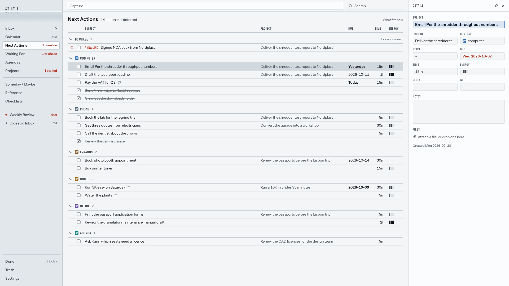
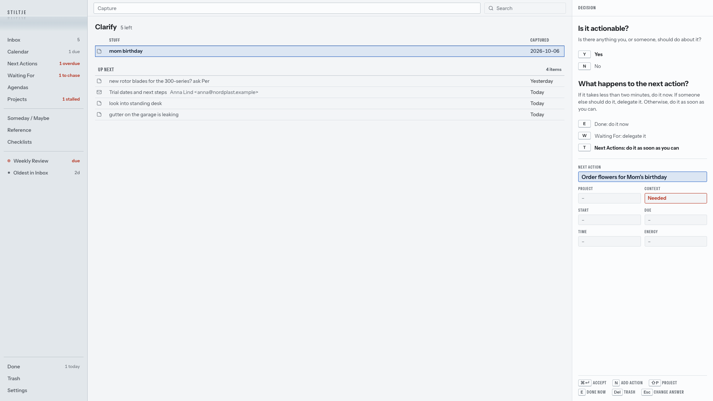
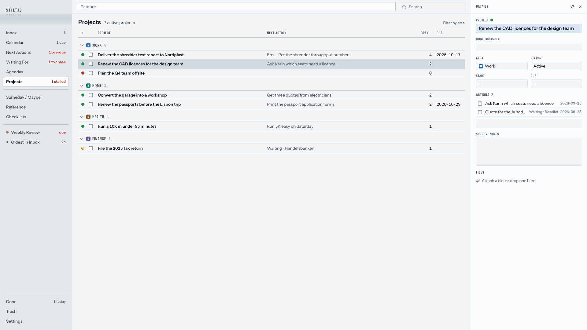
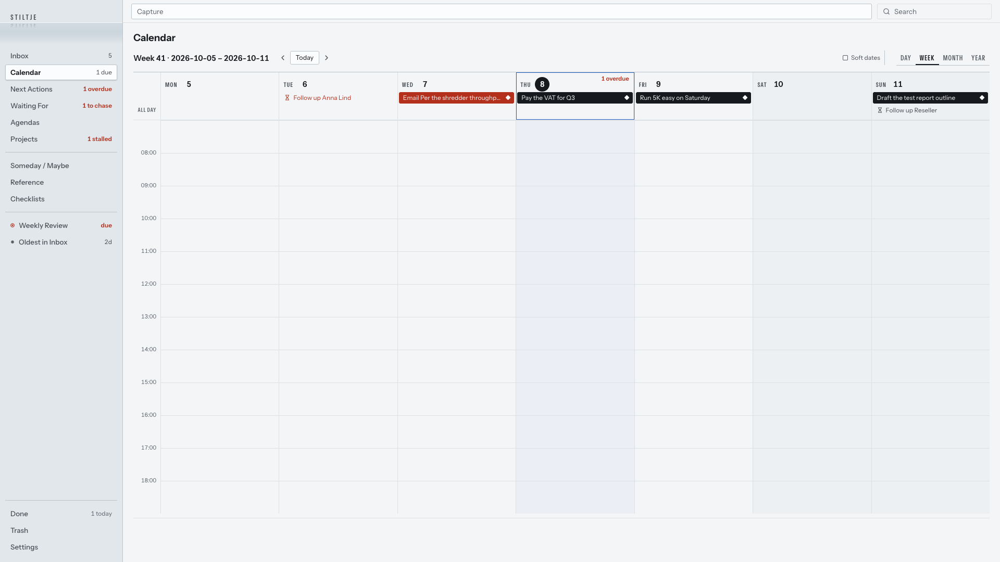
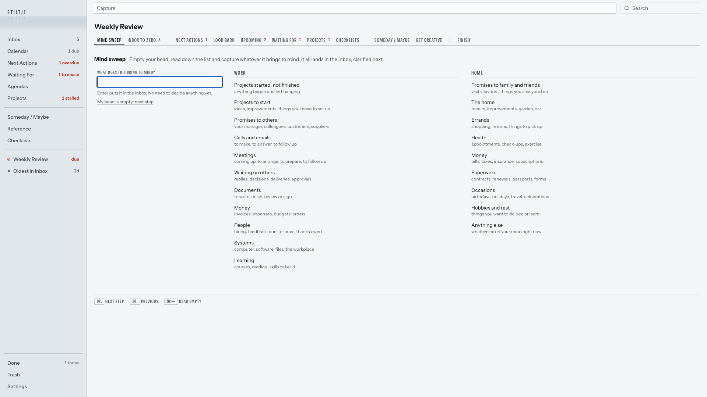
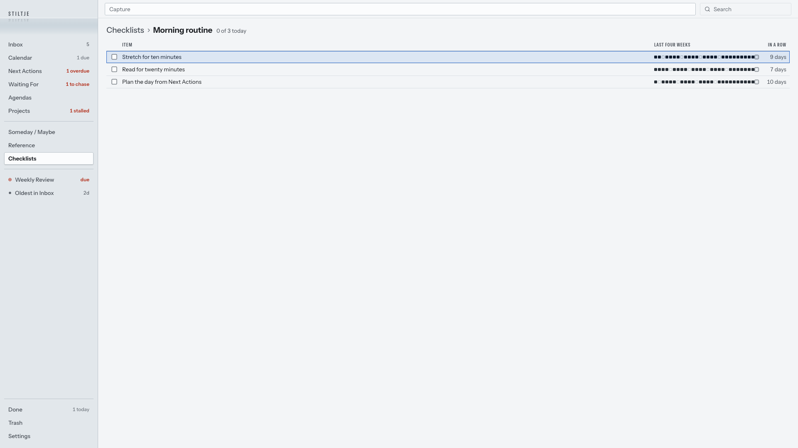

# Stiltje

A personal Getting Things Done system for one person. Capture anything into the Inbox, clarify it one item at a time along GTD's flowchart, and work from dense, keyboard-driven lists. It runs locally or on your own server; there are no AI features.



## What's in it

- **Capture:** type, paste text or an email, or drop in PDF, Word, text, images, .eml or .msg files. Each becomes one Inbox item.
- **Clarify:** *Is it actionable?* No: Someday / Maybe, a bring-back date, Reference, Checklist or Trash. Yes: do it now, delegate it to Waiting For, or put it on Next Actions; `P` adds it to a project.
- **Lists:** Next Actions by context (with *What fits now*), Waiting For by person, Agendas, Projects with traffic-light health, Someday / Maybe, Done and Trash.
- **Reference:** notes in Markdown with `[[links]]`, lists and documents; any of them can be locked with a password.
- **Checklists:** lists to run again and again, and daily or weekly routines with a four-week habit strip.
- **Calendar:** day, week, month and year, with your dates and subscribed ICS calendars (Outlook, iCloud).
- **Weekly Review:** Allen's steps in order, with checks for stalled projects, overdue actions and follow-ups due.
- **Phone:** a slimmer layout below 820px wide, with swipes and a + button that adds to the list you're on.
- **Your data:** SQLite on your machine or server; export everything as Markdown or JSON.

| | |
|---|---|
|  |  |
|  |  |



## Run it

Needs Node 22.13 or later.

```sh
npm install
npm run dev          # http://localhost:5173, data in data/
```

Try it on synthetic data first, kept apart in `data-demo/`:

```sh
npm run demo         # then, in a second terminal:
npm run demo:seed
```

On a server: `npm run build && npm start` (port 8787, behind HTTPS, with a password and authenticator login). [DEPLOY.md](DEPLOY.md) covers the whole setup, backups and updates.

## Keys

Everything works from the keyboard. `⌘K` lists every command and its keys for where you are; these are the ones to start with (on Windows and Linux, `⌘` is `Ctrl`):

| Keys | |
|---|---|
| `⌃1`–`6`, `⌃⇧1`–`5` | Go to a list, in the order of the rail |
| `⇧N` | Capture to the Inbox |
| `K` | Clarify the Inbox |
| `N` | New item on the list you're on |
| `⌥T` `⌥W` `⌥N` | New next action, waiting for or project, from anywhere |
| `Enter` / `Esc` | Open details / go back |
| `E` | Done |
| `⇧R` | Weekly Review |
| `⌥Q` | Search |
| `⌘Z` | Undo (there are no confirmation dialogs) |

How everything behaves, and why, is written down in [PRODUCT.md](PRODUCT.md); the look in [DESIGN.md](DESIGN.md).

## Built with

React and Vite in the browser; a small Node server (Hono) for files, calendar feeds and the login; SQLite for storage. `npm run typecheck` checks the types.
